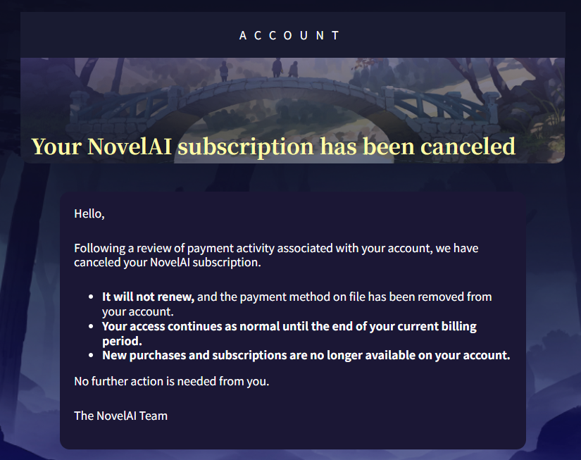

# NAI Launcher

  <a href="README.md">简体中文</a> · <a href="README.zh-TW.md">繁體中文</a> · English

> [!WARNING]
> **Project updates paused (2026-09-08)**
>
> NovelAI has restricted my account: my subscription was canceled, and I can no longer make purchases or subscribe. I still do not understand the specific reason for this action, so I have decided to pause updates to this project.

  

  <strong>More than image generation: your complete NovelAI creative workflow in one application.</strong>

  
  
  
  

  <a href="https://github.com/Aaalice233/Aaalice_NAI_Launcher/releases/latest">Download latest release</a> ·
  <a href="CHANGELOG.md">Read the changelog</a> ·
  <a href="https://github.com/Aaalice233/Aaalice_NAI_Launcher/issues">Report an issue</a> ·
  <a href="https://discord.gg/R48n6GwXzD">Join Discord</a>

> NAI Launcher is a community-developed third-party client, not an official NovelAI product. Bring your own NovelAI account for online features, and follow the applicable terms of service, content rules, and local laws.

NAI Launcher is built for people who use NovelAI regularly. Generation, editing, Prompts, characters, references, galleries, queues, and Agent Chat connect in one workflow. Windows, macOS, and Android share the same core features, and local tools work before you sign in.

## ✨ One complete creative workflow

| What you want to do | How NAI Launcher helps |
| --- | --- |
| **Start creating** | Write a Prompt, choose a model and parameters, then add characters, Vibes, Precise References, or a source image. |
| **Keep refining** | Use image-to-image, inpainting, outpainting, variations, and enhancement, or restore selected settings from an older image. |
| **Process a batch** | Queue multiple jobs, pause, resume, reorder, retry, and see real progress and Anlas cost. |
| **Build a library** | Organize artwork in the local gallery and turn tags, Vibes, and references into searchable personal libraries. |
| **Find inspiration** | Search several online galleries, inspect original Prompts and metadata, then continue from them in generation. |
| **Move between tools** | Connect Krita, ComfyUI, and cloud backup so the same workflow can continue on Android. |

## 🚀 Feature guide

### 🎨 NovelAI generation and editing

- Text-to-image, image-to-image, regular Inpaint, Focused Inpaint, Outpaint, variations, and enhancement are supported.
- Common NovelAI V5 Curated / Full, V4.5, V4, and V3 workflows are available. Controls, defaults, Token limits, and reference features follow the selected model's capabilities.
- Configure size, sampler, Steps, CFG, Seed, noise schedule, and related parameters. Invalid NovelAI dimensions are caught early with a usable size suggestion.
- Estimated Anlas cost appears before generation. Important paid actions require separate confirmation, and balances and statistics refresh afterward.
- Built-in history and previews let you reuse Prompts, Seeds, models, or selected settings without overwriting work still being edited.

### ✍️ Prompts, pinned tags, and characters

- Positive Prompts, negative Prompts, positive and negative pinned tags, and character content have clear editing areas, even in complex setups.
- Each character can have separate positive and negative Prompts, reference images, and a position. Character count and positioning adapt to the current model.
- The offline Danbooru / e621 catalog and aliases show completion, tag type, popularity, and translations. Optional Chinese and related-tag data packs add more context.
- Related-tag completion helps explore composition, clothing, poses, and visual elements, while Danbooru online results can fill in newer tags.
- Personal tag, pinned-tag, and random-tag libraries support categories, search, batch editing, and quick insertion.
- Switch between text and tag mode at the bottom-right of the input to edit original text, adjust weights, long-press and drag selected tags to reorder them, and undo. Simplified and Traditional Chinese interfaces display the same local Chinese translations below tags; other languages show only the original text. Selecting a complete tag in text mode also displays its translation when using a Chinese interface.
- Drag the bottom edge of the main prompt editor to resize it, or double-click the handle to restore automatic height. Text and tag modes share the same height.
- Disable and restore tags without losing their content. The `/*disabled:original fragment*/` notation is saved and cloud-synced with the Prompt, while disabled content is excluded from generation, effective previews, and Token counts. This is Launcher editing syntax; older clients and external tools may not recognize it. Choose “Copy effective prompt” from the menu for external use.
- Local translation misses can be sent to a configured AI translation service.
- Prompt Assistant tasks, including reverse prompting, optimization, and translation, share a configurable response wait timeout: 1, 2, 5, 10, 15, or 30 minutes, with a 5-minute default.
- Each Prompt Assistant provider saves its own automatic or manual concurrency mode. Automatic mode starts at 5 concurrent requests, and independent tag batches translate in parallel. Each task offers the thinking levels supported by its model. Configure these local settings under Settings → Integrations → Prompt Assistant.

### 🧬 Vibe, Precise Reference, and image editing

- Vibe Transfer accepts images, pre-encoded Vibes, and Bundles, with information extraction and reference strength controls and model-aware encoding reuse.
- Precise Reference supports character and style references, multi-select, batch type changes, and portable packages that include their images.
- Dedicated Vibe and Precise Reference libraries provide categories, search, previews, batch management, import/export, and direct use in the current generation.
- The inpaint editor includes brushes, masks, Focused Inpaint regions, and canvas expansion. Agent Chat can prepare a mask or outpaint draft for review.
- NovelAI image metadata can restore selected model, size, sampler, Steps, CFG, Seed, pinned tags, and character content.
- On Android, share a single image or a direct image link from apps such as Discord to NAI Launcher, then choose metadata import, img2img, or reference use. Direct links must be accessible, and restoring parameters requires an original image with metadata intact.

### 🗂️ Local gallery and artwork organization

- Scan only the folders you choose, then find artwork by folder, album, favorite status, Prompt, or generation metadata.
- Image details separate positive and negative Prompts, pinned tags, character content, and full parameters for all-at-once or selective copying.
- Batch categorization, favorites, moving, and deletion sit alongside comparison, slideshows, watermarks, redacted copies, and several viewing modes.
- In Settings → Privacy & Sharing, independently enable "Add watermark when copying or dragging" to apply the saved default watermark to an output copy without changing the original. Adding a watermark does not remove metadata. To remove it, also enable Protection Mode and "Remove all metadata when copying or dragging"; metadata is removed before the watermark is added.
- Desktop gets context menus, hover previews, and drag-and-drop; touch devices get equivalent menus instead of losing features.
- Persistent sidebars in the local gallery, Vibe library, Precise Reference library, and tag library can be resized by dragging. Each page remembers its width on this device only, outside cloud sync.
- Local gallery folders, albums, Vibe categories, and tag-library categories support original order or ascending/descending name and count sorting, remembered separately on this device only. Folders default to descending names, placing consistently formatted date folders newest first. Dragging to reorder starts from the displayed order and switches to original order automatically. Drag directly on desktop or long-press and drag on touchscreens; folders, albums, and tag-library categories also support nesting, while Vibe categories remain flat.
- Image and resource cards use consistent actions across context menus, More menus, and batch toolbars. Selected cards open batch actions; unselected cards act only on themselves. Desktop supports Ctrl/Cmd toggling, Shift range selection, and selecting the current page, with selection preserved across pages.
- Dragging a selected card includes the entire selected set: actual images for image cards and portable resource files for Vibes, Bundles, and Precise References. In-app targets include compatible generation references, Agent, categories, and albums; single-item targets reject multiple items.
- Local images can go directly to generation, Agent Chat, or Krita without repeated exports and file picking.

### 🔎 Online galleries and inspiration

- Browse Danbooru, Safebooru, Gelbooru, AI TAG, and Codex Gallery (NovelAI QuickTagCloud) from one place.
- Search, popular, random, ranking, date, rating, blacklist, and output filters appear according to each source's real capabilities.
- Local favorites work independently. Danbooru sign-in and Gelbooru API settings unlock the matching account features.
- Inspect multi-image posts, original Prompts, and structured generation metadata, download a set, or return recognized settings to generation.
- Codex Gallery includes public codices, categories, versions, multi-image and text entries, contributor credits, and recently viewed items.

### 🤖 Agent Chat

- From a desktop sidebar or mobile drawer, the agent can search tags, organize Prompts, inspect generation history, use libraries, and prepare generation tasks.
- Images, Vibes, and Precise References can be added directly as context. The agent can also prepare masks, expanded canvases, and inpaint drafts.
- Preparation verifies the cost before generation. In Full Access, verified zero-Anlas generations proceed directly; deletion and paid operations still require approval.
- The default character research workflow combines online identity verification, canonical tag lookup, and gallery appearance evidence, noting disabled web access or missing evidence.
- Customize the system prompt by adding plain-language instructions or replacing the built-in body; no placeholders are needed. The working directory, web availability, Skills, and app execution rules are added automatically, with a preview of the final prompt. Customization does not bypass app permission checks.
- Structured questions offer three feasible directions, one Recommended marker, and a custom-answer option per question. Answer sequentially, then review and submit the full set. After two minutes without submission, all recommended options are selected automatically. New questions show a Toast, a question-mark entry icon, and an Android system notification.
- Supports OpenAI-compatible APIs, Google's native Gemini API, third-party Gemini-compatible relays, and OpenRouter, including model lists, thinking levels, and tool calls when supported.
- Your provider controls API keys, regional availability, and fees. Extra network tools such as web search are off by default.

### 📋 Queue, history, and statistics

- Queue multiple generations, pause, resume, reorder, cancel, and retry failures.
- See per-job status, overall progress, and failure details without supervising every request.
- Review creation activity by time, image size, sampler, model, and Anlas usage.

### 🧩 Krita and ComfyUI

- **Krita Bridge** sends a Krita canvas to Launcher for generation or inpainting, then returns the result.
- **ComfyUI** connects to a local server for regular upscale or SeedVR2 workflows. Models and custom nodes stay under your ComfyUI installation.
- **DLSSNR image enhancement (Windows)**: Install the public runtime on demand and test your NVIDIA GPU under Settings → Integrations → DLSSNR. Supports automatic enhancement after generation (off by default), manual image-card enhancement, and a draggable before/after divider. The shared comparison viewer offers a Follow mouse toggle for inspecting details while zoomed in; the toggle preference is saved on this device. SR scale defaults to 2× and accepts manual input. SR upscaling is followed by a single NR evaluation, then enhancement/color blending. Includes seven built-in style presets, with Texture & light as the default and alternatives such as Color-preserving enhancement and Vivid, plus custom presets you can save, rename, and delete; the current selection and adjustments are saved automatically. Parameters include explanations and numeric input. Images are processed locally; manual saves create a new file, add it to the generation history as the latest result, and never overwrite the original.
- Gallery, preview, and editing flows can open these tools directly instead of requiring repeated manual exports.

### ☁️ Sync and backup

- Supports OneDrive, GitHub, and WebDAV. New Google Drive connections are temporarily disabled pending authorization approval. Connecting an account never uploads, downloads, or overwrites content by itself.
- Push, pull, and restore start only when requested, with change previews and conflict handling.
- Select settings, Prompts and libraries, previews, online-gallery settings and favorites, local albums, Agent Prompts and Skills, and optional Vibe or Precise Reference content independently.
- Original local and remote gallery images, credentials, caches, and logs never enter a backup.
- Backups use readable plain data and need no separate recovery key. Check the destination's permissions before syncing.

## 🖼️ Interface preview

### 🖥️ Desktop

<table>
  <tr>
    <td width="50%" align="center">
       
      Generation workspace: Prompts, parameters, preview, and Agent Chat together
    </td>
    <td width="50%" align="center">
       
      Local gallery: search, albums, folders, and batch organization
    </td>
  </tr>
  <tr>
    <td width="50%" align="center">
       
      Online galleries: multiple sources, filters, and masonry browsing
    </td>
    <td width="50%" align="center">
       
      Statistics dashboard: artwork, settings, and Anlas usage
    </td>
  </tr>
</table>

## 💻 Platform support

| Platform | Current status | Notes |
| --- | --- | --- |
| **Windows** | Primary development and release platform | Installer and portable packages are available. Well suited to long sessions, batch work, and Krita / ComfyUI integration. |
| **macOS** | Available and still being refined | A portable package is available. If macOS blocks an unnotarized build, allow it through the system security prompt. |
| **Android** | Beta | Supports phones, landscape, tablets, and large screens, with touch access to generation, galleries, libraries, queues, Agent Chat, and settings. |
| **Linux** | No official release package | No official download is currently provided. |

## ⚡ Download and get started

### 1. Download the package for your platform

Open [GitHub Releases](https://github.com/Aaalice233/Aaalice_NAI_Launcher/releases/latest):

| Platform | File | Usage |
| --- | --- | --- |
| Windows | `NAI_Launcher_Windows_<version>_Setup.exe` | Installer recommended for most users. |
| Windows | `NAI_Launcher_Windows_<version>_Portable.zip` | Portable package; extract and run. |
| macOS | `NAI_Launcher_macOS_<version>_Portable.zip` | Extract and open `Aaalice NAI Launcher.app`. |
| Android | `NAI_Launcher_Android_<version>.apk` | Sideload the APK. The first install may require permission to install unknown apps. |

Every release includes `checksums.txt`. If an archive cannot be extracted or installed, verify the downloaded file first.

### 2. Sign in to NovelAI

Sign in with NovelAI credentials or a **Persistent API Token**. If web security verification prevents password login, a Persistent API Token is usually more reliable. The token is stored only in the current device's secure storage.

### 3. Set up the resources you use

- Select your artwork folders in Settings, then open the local gallery to start scanning.
- Manage the Chinese translation catalog, related-tag data pack, and online caches under **Settings → Data Sources & Cache**.
- For Krita, enable Krita Bridge and follow the [Krita plugin guide](krita_plugin/README.md).
- For ComfyUI, enter the local address and choose a workflow under **Settings → ComfyUI**.
- For cross-device use, connect a destination on the cloud-sync page and carefully select what should be included.

## 🔒 Data and privacy

NAI Launcher does not host your account or artwork on a project-operated server. Data is sent to another service only when you actively use the related feature:

| Feature in use | Where the data goes |
| --- | --- |
| Generation, image-to-image, inpainting, Vibe encoding | NovelAI, including the Prompt, parameters, and source or reference images required for that request. |
| Online gallery search and downloads | The third-party gallery you selected. Availability, rate limits, and content rules belong to each site. |
| AI translation or Agent Chat | The model service you configured. Conversations, attached images, and tool results required by the task may incur provider fees. |
| Sync and backup | Your selected Google Drive, OneDrive, GitHub, or WebDAV destination. Only explicitly selected content is uploaded. |

- NovelAI Tokens, OAuth access/refresh tokens, WebDAV passwords, and GitHub Tokens use device secure storage and are never written into backups.
- Local Prompts, gallery indexes, tags, resource libraries, and Agent sessions stay on the device by default.
- Cloud backups store selected data in plaintext. Local gallery image files are not uploaded; albums, categories, and membership references can sync as lightweight data.
- Online galleries can contain third-party content. Rating filters do not replace user judgment.
- WebDAV security depends on the server and transport you configure. Keep a local copy of important data.

## 🆘 Support and feedback

- If something goes wrong, use **Settings → About → Export diagnostic logs** and attach the exported information to your report.
- [Open an Issue](https://github.com/Aaalice233/Aaalice_NAI_Launcher/issues) for a reproducible bug or feature request.
- [Join Discord](https://discord.gg/R48n6GwXzD) for usage discussion and community help.
- [View Releases](https://github.com/Aaalice233/Aaalice_NAI_Launcher/releases) to download packages, verify files, and read release notes.

## 🙏 Acknowledgments

Thanks to [NovelAI](https://novelai.net/), [Codex Gallery](https://novelai.quicktagcloud.com/), [AgIzT/NovelAI-Tag](https://github.com/AgIzT/NovelAI-Tag), [Flutter](https://flutter.dev/), [Riverpod](https://riverpod.dev/), and all contributors and testers.

## 📄 License

This project is open source under the [MIT License](LICENSE).
